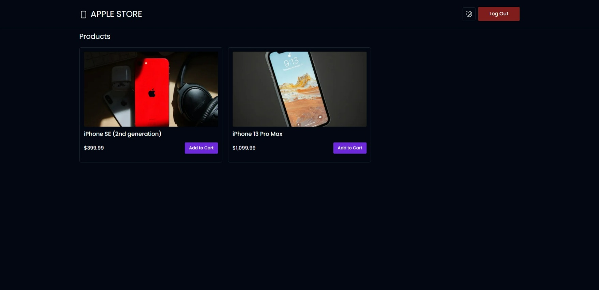
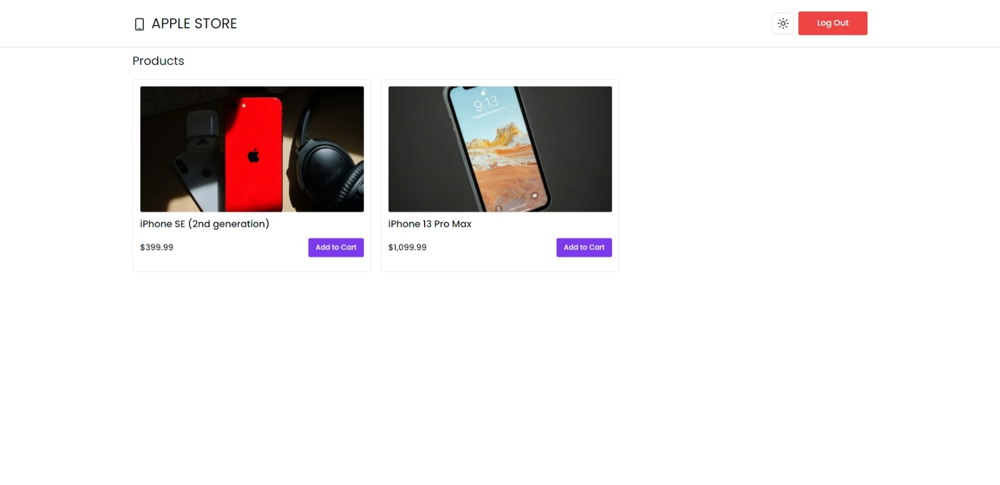
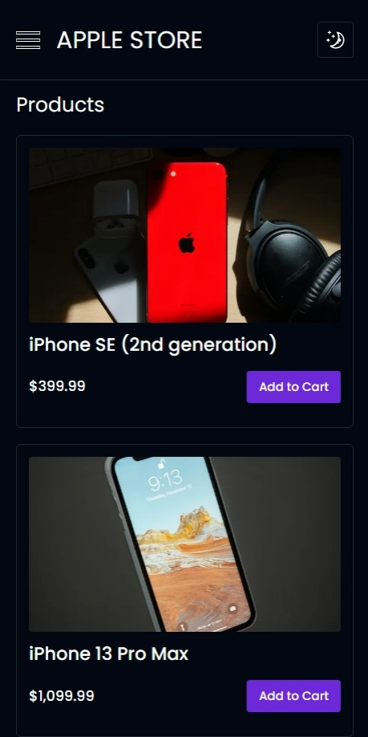
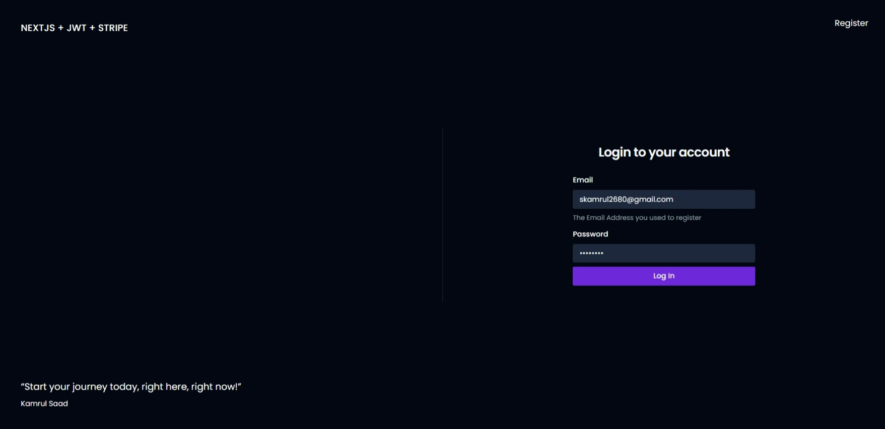

# NEXTJS + JWT + STRIPE

## Table of Contents

- [Overview](#overview)
  - [Screenshot](#preview)
  - [Links](#links)
- [How to run](#how-to-run)
- [My process](#my-process)
  - [Built with](#built-with)
  - [Features](#features)

---

## Overview

A modern full-stack web application based on `Nextjs 13.5.5` and `TypeScript` with `JWT` authentication and `Stripe` payment processing. 

## Links

- Live Site Link: [Click Here](https://nextjs-jwt-stripe.vercel.app/) to see the Live website.
- Project Overview Video: [Click Here](https://www.loom.com/share/4670a574363d46998bfe3e5ef938b3a0?sid=14fd1732-4b50-4dea-98bd-cb31533c580c) to see the project overview video. (5 mins)
- Github Repo: [Click Here](https://github.com/kamrulsaad/nextjs-jwt-stripe) to check the github repo for this project.

## Preview

---

## How to run

- Clone the project from the GitHub repo.
- Run `yarn install` to install all the dependencies.
- Run `yarn prisma migrate dev --name init` to migrate the database. (You need to have Postgres installed in your system)
- Run `yarn run dev` to run the project.

## My Process

I used `RTK Query` for data fetching for the authentication part. Instead of `jsonwebtoken`, I tried to use something different, and `jose` is the package I used for JWT authentication. It uses the same system as a JWT authentication system but provides more extra features that we can benefit from in many different ways. 

Webhooks have been used to implement `stripe` test payment processing. It just needs a simple configuration and provides a lot of features.

For more details, please check the following video, It will take only 5 minutes to understand the overall system if you watch the video: [Click Here](https://www.loom.com/share/4670a574363d46998bfe3e5ef938b3a0?sid=14fd1732-4b50-4dea-98bd-cb31533c580c)

## Built With

- [React](https://reactjs.org/) - JS library
- [Next.js 13.5.5](https://nextjs.org/) - React framework
- [TypeScript](https://www.typescriptlang.org/) - JS Superset
- [axios](https://axios-http.com/) - Promise based HTTP client
- [TailwindCSS](https://tailwindcss.com/) - CSS framework
- [Shadcn-ui](https://ui.shadcn.com/) - UI Component library
- [React-hook-form](https://react-hook-form.com/) - Forms
- [React-redux](https://react-redux.js.org/) - State Management
- [RTK-query](https://redux-toolkit.js.org/rtk-query/overview) - Data Fetching
- [Zod](https://zod.dev/) - Data Validation
- [Prisma](https://www.prisma.io/) - ORM
- [PostgreSQL](https://www.postgresql.org/) - Database
- [Stripe](https://stripe.com/) - Payment Processing
- [Vercel](https://vercel.com/) - Hosting
- [Jose](https://www.npmjs.com/package/jose) - JWT Authentication
- [Bcryptjs](https://www.npmjs.com/package/bcryptjs) - Password Hashing
- [EsLint](https://eslint.org/) - Linter

## Features

Users should be able to:

- See a Beautiful, animated, and responsive landing page
- Login and Register using your name, email, and password
- Choose their desired product from the listing provided.
- Increase or decrease the quantity of the product selected in the cart.
- Make payment using the Stripe payment gateway.

---
